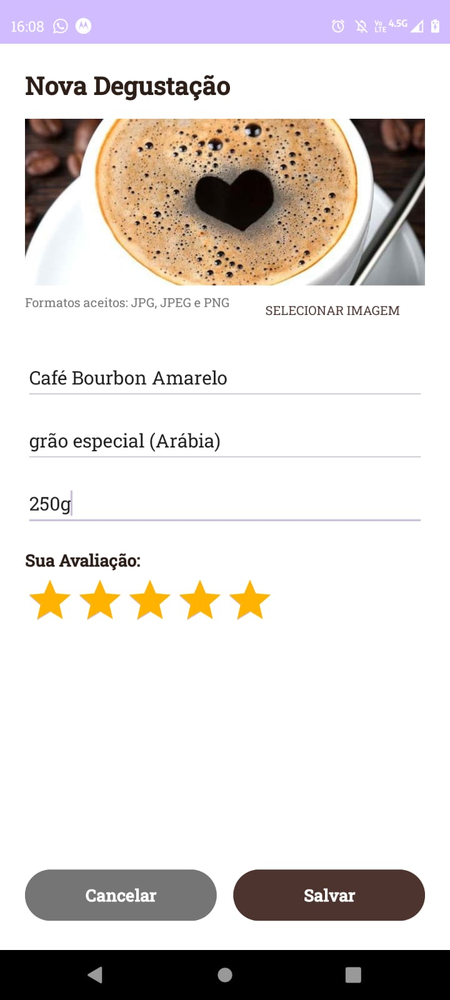
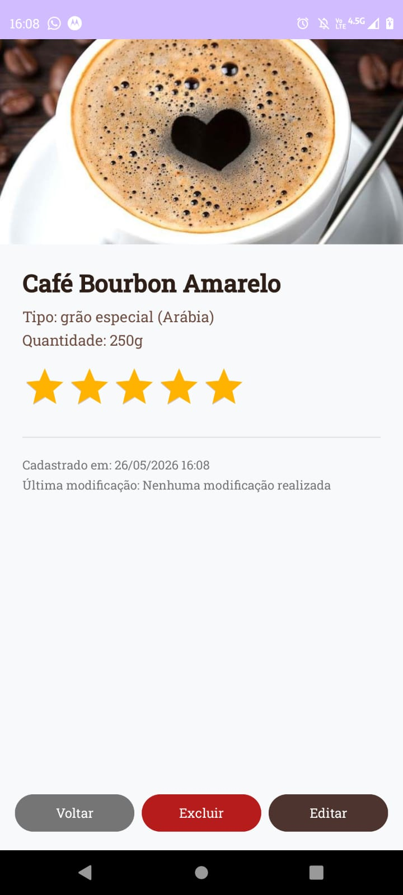
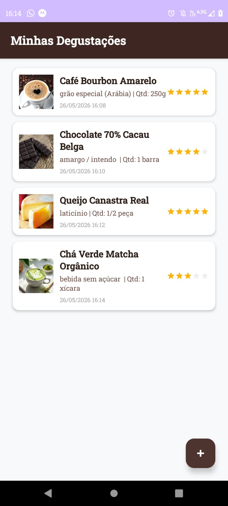

# Catálogo de Degustação

O Catálogo de Degustação é um aplicativo Android nativo projetado para registrar, organizar e avaliar diferentes experiências sensoriais gastronômicas. A aplicação permite catalogar uma variedade de itens (como cafés, chás, chocolates, bebidas e alimentos em geral), funcionando como um diário pessoal de degustação com suporte para armazenamento de imagens, controle de quantidades, notas de avaliação e histórico de modificações.

## 📱 Telas do Aplicativo

<!-- Substitua os links 'caminho/para/imagem.png' pelo link real ou caminho local das suas imagens -->
<p align="center">
  
  &nbsp; &nbsp;
  
  &nbsp; &nbsp;
  
  &nbsp; &nbsp;
  
</p>aminho/para/imagem3.png

## Objetivos do Projeto

Este projeto possui caráter acadêmico e tem como finalidade a aplicação prática dos conceitos fundamentais do desenvolvimento de software para a plataforma Android. O foco do desenvolvimento estruturou-se em:
* Construção de interfaces dinâmicas utilizando layouts XML estruturados.
* Gerenciamento de persistência de dados local de forma simplificada.
* Manipulação do sistema de arquivos interno do dispositivo para armazenamento seguro de mídias.
* Controle de fluxo de navegação entre múltiplas atividades com passagem de parâmetros.

## Funcionalidades

* **Cadastro de Degustações:** Permite a inclusão de novos registros contendo nome do item, tipo/categoria, quantidade descritiva e nota de avaliação por meio de estrelas (*RatingBar*).
* **Persistência de Imagens:** Seleção de imagens da galeria do dispositivo com um sistema de cópia automática para o armazenamento interno e privado do aplicativo, evitando a perda de acesso por expiração de permissões temporárias do sistema operacional.
* **Histórico Cronológico:** Geração automática e imutável da data e hora de criação do registro, além do rastreamento automático da data e hora da última modificação sempre que o item for editado.
* **Visualização Avançada:** Tela de detalhes dedicada para exibição completa de todas as informações salvas de um registro específico, incluindo a foto em tamanho expandido.
* **Edição de Registros:** Possibilidade de alterar qualquer informação ou imagem de um registro já existente, reaproveitando a interface de formulário.
* **Exclusão com Confirmação:** Sistema de remoção de itens com aviso de segurança (*AlertDialog*) para prevenir a perda acidental de dados.
* **Controle de Estado Vazio:** Interface inteligente (*Empty State*) que exibe uma mensagem instrutiva caso não existam registros salvos no banco de dados.
* **Persistência Local:** Salvamento definitivo dos dados no dispositivo utilizando armazenamento baseado em formato JSON, garantindo que as informações permaneçam salvas após o fechamento do aplicativo.

## Tecnologias Utilizadas

* **Linguagem:** Kotlin
* **Interface Gráfica:** XML Layouts (`ConstraintLayout`, `LinearLayout`, `CardView`) baseados nas diretrizes do Material Design.
* **Listagem Dinâmica:** `RecyclerView` com padrão *Adapter* customizado.
* **Armazenamento:** `SharedPreferences` para persistência local combinada com serialização em objetos JSON (`JSONArray` e `JSONObject`).
* **Seleção de Mídia:** API `ActivityResultContracts.GetContent` para integração com o gerenciador de arquivos do sistema.

## Estrutura de Arquivos

```text
com.example.degustacatalogo/
│
├── MainActivity.kt        # Gerencia a listagem principal e o controle de estado vazio
├── FormActivity.kt        # Gerencia o formulário de cadastro, edição e verificação de imagens
├── DetailActivity.kt      # Gerencia a exibição detalhada de um item e a ação de exclusão
├── Degustacao.kt          # Modelo de dados (Classe de dados do objeto)
├── BancoDeDados.kt        # Responsável pelos métodos de salvar e carregar dados em JSON
└── DegustacaoAdapter.kt   # Vincula a lista de objetos aos componentes visuais do RecyclerView
